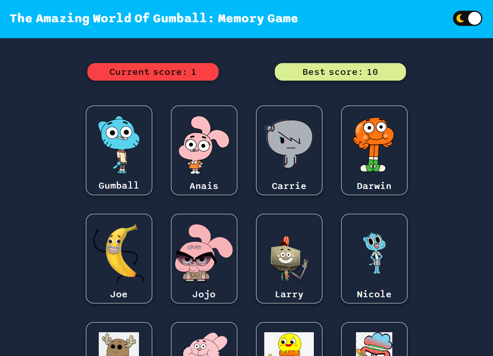
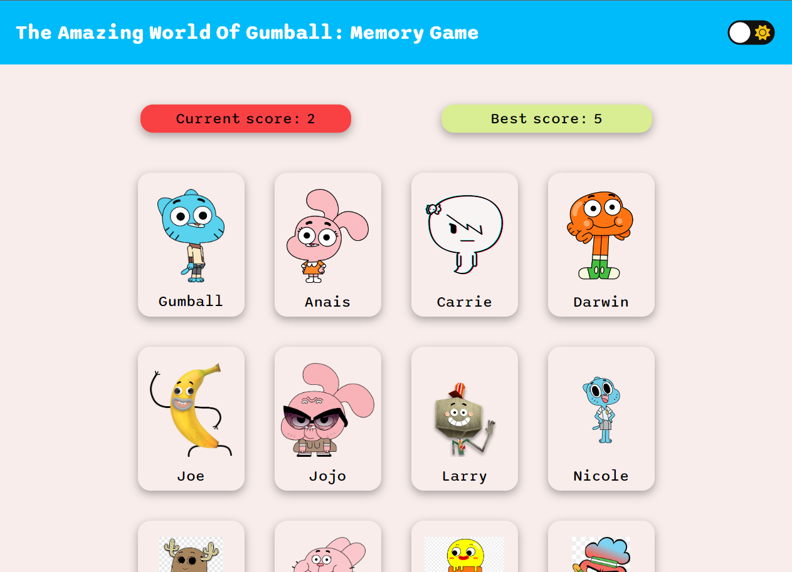
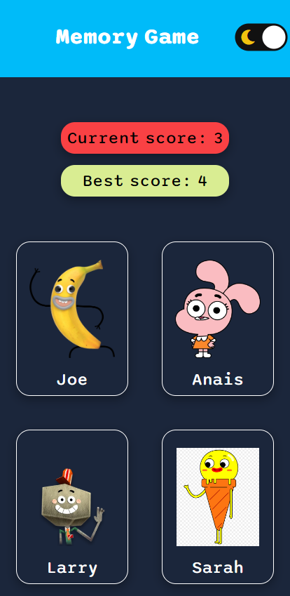

 
 <h1 align="center">Memory Game</h1>

 <a href="#-layout">Layout  |</a> 
 <a href="#-project">Project |</a> 
 <a href="#-tecnologias">Technology |</a> 
 <a href="#-licença">License</a> 

## 🎨 Layout

 
 
 

## 💻 Project

Live preview: https://barbosathaissa.github.io/memory-game/

A memory card game with The Amazing World Of Gumball characters using JavaScript and React.

The objective is to select as many characters as possible without clicking on the same one twice. The score is incremented by 1 each time the user successfully chooses a card that has not yet been selected and it is reset to 0 when the user select the same card twice.

## 🚀 Tecnologias

This project was developed with the following technology:

- React.JS
- Styled Components
- JavaScript
- Node.JS
- Git and Github

## :memo: Licença

This project is under the MIT license

 

Made with 💜 by myself : [My contact!] [contatothaissabarbosa@gmail.com]

